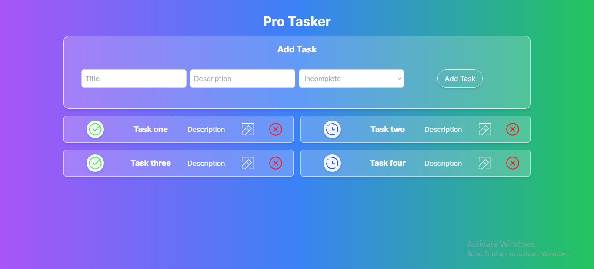
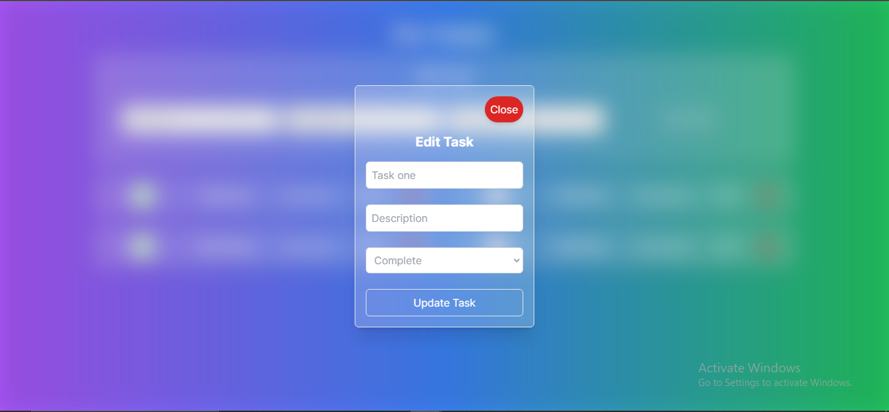
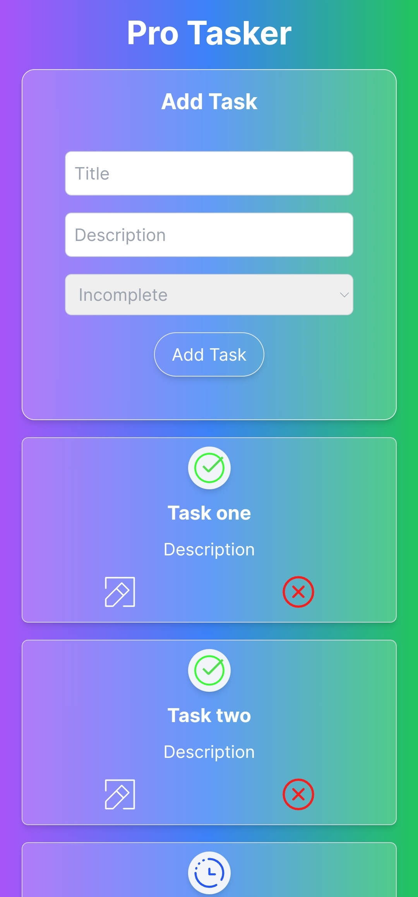
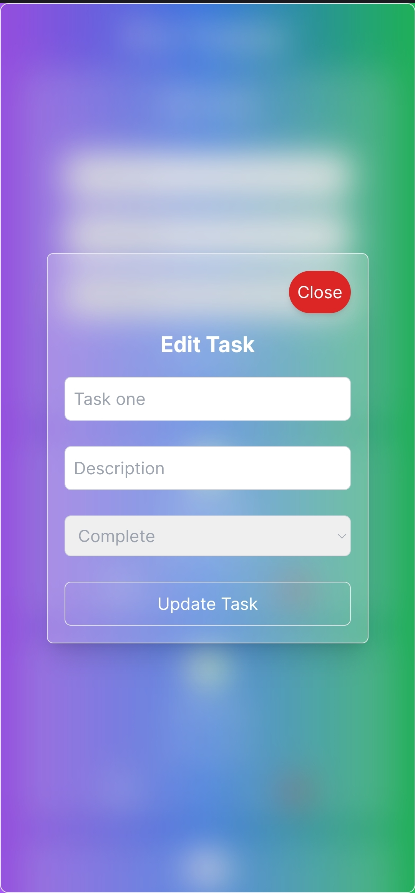

# Pro Tasker

## Deployed Link : - https://pro-tasker-psi.vercel.app/
 
Pro Tasker is a task management application built with Next.js, TypeScript, Tailwind CSS, and MST (Mobx State Tree). It allows users to create, view, update, and delete tasks. The application incorporates the specified technologies and follows best practices in terms of code organization, styling, responsiveness, and version control.

## Installation
- Clone the repository: git clone <repository_url> 
- Navigate to the project directory: cd pro-tasker
- Install dependencies: npm install
## Getting Started
- Start the development server: npm run dev
- Open your browser and visit: http://localhost:3000
## Features
## User Interface
## Pro Tasker provides a user-friendly interface with the following features:

- View tasks: The application displays a list of tasks, showing the title, description, and status of each task.
- Add a task: Users can create a new task by providing a title, and description, and selecting a status.
- Edit a task: Users can update the title, description, and status of an existing task.
- Delete a task: Users can delete a task, removing it from the task list.

## Task Management Functionality
## Each task in Pro Tasker has the following properties:

- Title: A brief title describing the task.
- Description: A detailed description of the task.
- Status: The current status of the task (e.g., "To Do," "In Progress," "Completed").
## The application supports the following operations:

- Create: Users can create a new task by clicking the "Add Task" button and filling out the task details in the provided form.
- Read: All tasks are displayed in a list, allowing users to view their titles, descriptions, and statuses.
- Update: Users can edit a task by clicking the "Edit" button associated with each task and modifying the task details in the edit form.
- Delete: Users can delete a task by clicking the "Delete" button associated with each task.
- Code Structure and Best Practices

## Pro Tasker follows best practices for code organization, project structure, and maintainability:

- The codebase is organized in a modular and maintainable manner, with separate folders for components, pages, and stores.
- TypeScript is used to ensure type safety and improve maintainability.
- Tailwind CSS is utilized for styling and layout purposes, allowing for easy customization and responsiveness.
- MST (Mobx State Tree) is used for state management and local store, providing a structured and scalable approach to managing application state.
- Error handling and validation are implemented to provide a smooth user experience and prevent unexpected behavior.
Git Version Control
- Pro Tasker is managed using Git version control. The project repository includes branches, commits, and pull requests to demonstrate an understanding of Git.

## Technologies Used
- Next.js
- TypeScript
- Tailwind CSS
- MST (Mobx State Tree)
- Git

## Screenshots: - 

## Large screens: - 

 
 

## Small screens: - 

  

 
 

  

